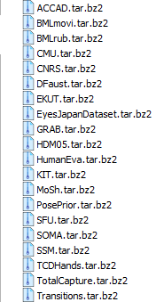

# Freetalker: Controllable Speech and Text-Driven Gesture Generation Based on Diffusion Models for Enhanced Speaker Naturalness

### [Homepage](https://youngseng.github.io/FreeTalker/) | [Arxiv](https://arxiv.org/abs/2401.03476) | [Demo Video](https://www.youtube.com/watch?v=jFovElT8VOk)


## 1. Experimental setting

The code is tested on `NVIDIA GeForce RTX 4090` and `CUDA Version: 12.2`. The environment is as follows:

```gitignore
conda env create -f environment_priormdm.yml
conda activate PriorMDM
pip install bvh librosa essentia pydub praat-parselmouth torchgeometry moviepy matplotlib==3.1.3
pip install smplx[all]
pip install git+https://github.com/openai/CLIP.git
```

## 2. Quick start

Download the pre-trained model from [Google Disk](https://drive.google.com/drive/folders/1M2m_3S5I5SgnPU1bWNeX0r2wKWDV9maW?usp=sharing) or [Baidu Disk](https://pan.baidu.com/s/1Daid71D5-7RiSQ_9VqSzwA?pwd=bdzb) and place it in the `./save` folder.

```gitignore
python -m sample.double_take --save_dir '' --guidacnce_param 1 --model_name model001000000 --BEAT_wav_feat ./datasets/BEAT/my_wav_feat/ --HUMANML3D_text_feat ./datasets/SMPLX/HumanML3D/v3_HUMANML3D_txt_feat/ --clip_model_path ./data/clip --vis_mode customized_controls
```

Then you can find the generated video in the `./save/my_v3_0/model001000000` folder.

<details>
  <summary><b>Video result</b></summary>
  
https://github.com/YoungSeng/FreeTalker/assets/37477030/a29d261c-d62c-457b-8a94-fb73e263ae73

</details>

You can use the following command to generate the video with audio:

```gitignore
python -m sample.double_take --save_dir '' --guidacnce_param 1 --model_name model001000000 --BEAT_wav_feat ./datasets/BEAT/my_wav_feat/ --HUMANML3D_text_feat ./datasets/SMPLX/HumanML3D/v3_HUMANML3D_txt_feat/ --clip_model_path ./data/clip --vis_mode vis_controls
python -m process.merge_mp4_audio --video_file ./save/my_v3_0/model001000000/positions_vis1_1.0_vis_controls.mp4 
```

<details>
  <summary><b>Video result with audio</b></summary>
  
https://github.com/YoungSeng/FreeTalker/assets/37477030/718c98ff-9b47-44e9-a0e0-467d8c5b6d67

</details>

(Optional) You might use [human_body_prior](https://github.com/nghorbani/human_body_prior) and `mdm_motion2smpl.py` generate SMPLX motion (without hands/fingers) from the generated file (Note that you need to modify `mdm_motion2smpl.py` and the environment of `human_body_prior` is tested on `NVIDIA GeForce RTX 2080 Ti` and `CUDA Version: 12.2`):

```gitignore
python ../human_body_prior/tutorials/mdm_motion2smpl.py --input ./save/my_v3_0/model001000000/result_rec_1.0.npy --output ./save/my_v3_0/model001000000/result_rec_1.0_smplx.npz
```

And then you can use [blender](https://www.blender.org/) to view the SMPLX motion.

<details>
  <summary><b>Video result converted to SMPLX</b></summary>

https://github.com/YoungSeng/FreeTalker/assets/37477030/2453db32-669d-41a3-a5e0-7bfbddc5ce68

</details>

## 3. Retraining the model

### 3.1 Data preparation

#### Text2Motion

Text2motion [Text](https://github.com/EricGuo5513/HumanML3D/blob/main/HumanML3D/texts.zip) and [Mapping](https://github.com/EricGuo5513/HumanML3D/blob/99b33e1cc7826ae96b0ee11a734453e250e5e75f/index.csv) we have provided in the `./prepare` folder.

Download Text2Motion motion files in SMPLX format from [AMASS](https://amass.is.tue.mpg.de/) and place them in the `./datasets/SMPLX/` folder:

<div align=center>

</div>

```gitignore
python -m prepare.prepare --smplx_folder ./datasets/SMPLX/
cd prepare
unzip texts.zip
python map_index.py --smplx_folder ./datasets/SMPLX/ --processed_motion_path ./datasets/SMPLX/HumanML3D/motion_data/processed/ --processed_text_path ./datasets/SMPLX/HumanML3D/text_data/processed
```

The total number of text-motion (SMPLX) pairs after processing is 13248.

#### Audio2Gesture

Download updated BEAT from [here](https://drive.google.com/file/d/1Akf0WgAwuH2fvlWbvNpif4XRqXlpznh9/view?pli=1).

```gitignore
cd ../process
python BEAT2smplx.py --source_BEAT_path ../datasets/BEAT/beat_english_v0.2.1/ --save_BEAT_smplx_path ../datasets/BEAT/my_smplx
```

#### Prepare features

Download the [WavLM Large](https://github.com/microsoft/unilm/tree/master/wavlm) and put it into `./data/wavlm_cache/` folder.

Download SMPL-X Model from [here](https://smpl-x.is.tue.mpg.de/) or from **2. Quick start**.

```gitignore
# Adjust the orientation of the motion and downsample AMASS dataset
python process_amass.py --source_HumanML3D_motion ../datasets/SMPLX/HumanML3D/motion_data/processed --processed_motion ../datasets/SMPLX/HumanML3D/processed_motion/ --index_path ../prepare/index.csv
# Extract audio/text features and downsample BEAT dataset, split the dataset into train/val/test
bash process_dataset.sh "prepare" "../datasets/BEAT" "../datasets/SMPLX/HumanML3D" "../data/wavlm_cache/WavLM-Large.pt" "../data/clip" "../data/prcocessed_data"
# Convert the motion format of the SMPLX to position, and extract the motion features
bash process_SMPLX.sh "../human_body_prior/support_data/dowloads/models/" '../datasets/BEAT/my_downsample' "../datasets/SMPLX/HumanML3D/"
# Generate h5 file and calculate the statistics of the motion
bash process_dataset.sh "generate_h5_file" "../datasets/BEAT" "../datasets/SMPLX/HumanML3D" "../data/wavlm_cache/WavLM-Large.pt" "../data/clip" "../data/prcocessed_data"
```

After this step, you should get `v3_train.h5`, `v3_mean.npy` and `v3_std.npy` in `./data/prcocessed_data` fold.

### 3.2 Training

```gitignore
cd ..
python -m train.train_mdm --save_dir save/my_v3_0 --overwrite --batch_size 256 --n_frames 180 --n_seed 0 --h5file_path ./data/prcocessed_data/v3_train.h5 --statistics_path ./data/prcocessed_data
```

Then you will get the model in `./save/my_v3_0` fold.


### Issues

We noticed that the generated results sometimes have sudden changes in orientation, which may be related to the diversity of character motions in HUMANML3D, which may be optimized by data preprocessing or by better motion representation.


### Bibtex
If you find this code useful in your research, please cite:

```
@inproceedings{
yang2024Freetalker,
title={Freetalker: Controllable Speech and Text-Driven Gesture Generation Based on Diffusion Models for Enhanced Speaker Naturalness},
author={Sicheng Yang and Zunnan Xu and Haiwei Xue and Yongkang Cheng and Shaoli Huang and Mingming Gong and Zhiyong Wu},
booktitle={ICASSP 2024 - 2024 IEEE International Conference on Acoustics, Speech and Signal Processing (ICASSP)}, 
year={2024},
}
```

If you have any problem, please raise an issue or contact me at [youngseng@qq.com](youngseng@qq.com).
